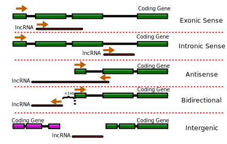

```{r setup, include=FALSE}
```

```{r lncRNA data prepare}
lncRNA <- fread(type.list$lncRNA)
setnames(lncRNA, c('Gene', 'Transcript', 'Type', 'Potential', 'Length', '我怎么知道这是什么东西？', 'Class'))
lncRNA[, Type := toUpperFirstLetter(sub("_", " ", Type))]
```

CDF {data-navmenu="Assembly"}
=====================================

```{r}
# Order first, for using geom_line later (geom_step behaves badly when calling plotly, see https://github.com/ropensci/plotly/issues/1030)
# cdf <- cdf[order(cdf[, 1], cdf[, 2])]
# Subset data randomly
lncRNA.subset <- lncRNA[sample(nrow(lncRNA),nrow(lncRNA) * params$cdf.percent / 100),]
```

Column
-------------------------------------

### *CDF* against *CPAT*

```{r}
p <- ggplot() +
  geom_line(data = lncRNA.subset, aes(x = Potential, colour = Type), size = 2, stat = 'ecdf') +
  scale_x_continuous(expand  = c(.01, 0)) + scale_y_continuous(expand = c(0, 0)) +
  labs(x = 'Coding Probablity(CPAT)', title = "Coding Potential", y = "CDF") +
  geom_hline(yintercept = 1, colour = "grey", linetype = "dashed", size = 1) +
  get(paste0('scale_color_',params$theme))()
save_plot('CDF.tiff', p, base_height = 8.5, base_width = 11, dpi = 300, compression = 'lzw')
ggplotly(p)
rm(p)
invisible(gc())
```

Column
-------------------------------------

### Description

**Title** Statistics of lncRNAs identified by lncPipe

**What have we done**  Briefly, lncRNAs identified by [lncPipe](https://github.com/likelet/LncPipe) contains novel and known lncs, this section sysmeticly summarize and compare the two categories in at length, coding potential and classification level. In LncPipe, coding poteintial of final lncRNAs were reassesed by CNCI, so CNCI CDS data were plot accordingly which coding genes were also considered; Besides, we summarized length distribution of noval and knon lncs and classified lncRNAs based on thier genome location to nearest protein coding genes. The following figure illustrate the classicification categories.

<div>
```{r echo=FALSE, out.width = '100%'}

```
</div>

**What dose plots mean** As metioned above, this section contains `CDF plot`, `length distrition plot`, `lncRNA classification plot` and `result table`. Of those :

`CDF plot` represents the coding potential score of lncRNA distribution that also called Cumulative Distribution Function plot, which is the probability that the variable takes a value less than or equal to x. The horizontal axis is the allowable domain for the given probability function. Since the vertical axis is a probability, it must fall between zero and one. It increases from zero to one as we go from left to right on the horizontal axis.

`length distrition plot` gives the length distribution of known and novel lncRNA, the X axis is length of lncRNA sequence and Y axix is the fraction of lncRNA at specify length. To note, not all the length number were plot, while length number largger than `max.length` parameter were sum and show ">10000" for instance.

`lncRNA classification plot` showns the fraction of differ kind of lncRNA in novel and knowns. Classification information were produced by lncPipe and illustrated at above figures.

**Reference:**

1. Mao A-P, Shen J, Zuo Z. Expression and regulation of long noncoding RNAs in TLR4 signaling in mouse macrophages. BMC Genomics. 2015;16:45. 

### *CPAT* table

```{r}
fwrite(lncRNA[, -6], 'lncRNAs.csv')
DT::datatable(head(lncRNA[, -(6:7)], n = 80L)) %>% DT::formatRound('Potential', digits = 2)
```

Stats {data-navmenu="Assembly"}
=====================================

```{r parsing GTF file}
# Use sum of exon length as transcript length
lncRNA.gtf <- unique(lncRNA[, Length := sum(Length), by = .(Gene, Type)], by = 'Gene')
```

Column {.tabset}
-------------------------------------

### lncRNA length distribution with type

```{r}
lncRNA.gtf[Length > params$max.lncrna.len, Length := params$max.lncrna.len]
p <- ggplot() + geom_density(data = lncRNA.gtf, aes(x = Length, colour = Type), size = 1.5) +
  xlab('Transcript length') + ylab('Density') +
  scale_x_continuous(breaks = seq.int(200, params$max.lncrna.len, length.out = 10),
                     labels = c(seq.int(200, params$max.lncrna.len, length.out = 9),
                                paste0(params$max.lncrna.len, '+')), 
                     expand = c(0.01, 0)) +
  scale_y_continuous(expand = c(0.01, 0)) +
  get(paste0('scale_color_',params$theme))()
save_plot('lncRNA_length_distribution_with_type.tiff', p, base_height = 8.5, base_width = 11, dpi = 300, compression = 'lzw')
ggplotly(p) %>% layout(margin = list(r = 50))
rm(p)
invisible(gc())
```

### Total lncRNA length distribution

```{r}
p <- ggplot() + geom_histogram(data = lncRNA.gtf, aes(x = Length), binwidth = 100) +
  scale_x_continuous(breaks = seq.int(200, params$max.lncrna.len, length.out = 10),
                     labels = c(seq.int(200, params$max.lncrna.len, length.out = 9),
                                paste0(params$max.lncrna.len, '+')),
                     expand = c(0.01, 0)) +
  scale_y_continuous(expand = c(0, 10)) + labs(x = 'lncRNA length', y = 'Count')
save_plot('lncRNA_length_distribution.tiff', p, base_height = 8.5, base_width = 11, dpi = 300, compression = 'lzw')
ggplotly(p) %>% layout(margin = list(r = 50))
rm(p)
invisible(gc())
```

### lncRNA classification

```{r lncRNA classification}
cls <- lncRNA[, .(count = .N), by = Class]
colors <- c('rgb(211,94,96)', 'rgb(128,133,133)', 'rgb(144,103,167)', 'rgb(171,104,87)', 'rgb(114,147,203)')
plot_ly(cls, labels = ~Class, values = ~count, type = 'pie',
        textposition = 'inside',
        textinfo = 'label+percent',
        insidetextfont = list(color = '#FFFFFF'),
        hoverinfo = 'text',
        text = ~paste(Class, 'total count:', count),
        marker = list(colors = colors,
                      line = list(color = '#FFFFFF', width = 1)),
                      #The 'pull' attribute can also be used to create space between the sectors
        showlegend = FALSE) %>%
  layout(xaxis = list(showgrid = FALSE, zeroline = FALSE, showticklabels = FALSE),
         yaxis = list(showgrid = FALSE, zeroline = FALSE, showticklabels = FALSE))
```

Column
-------------------------------------

### Description

**Title** Statistics of lncRNAs identified by lncPipe

**What have we done**  Briefly, lncRNAs identified by [lncPipe](https://github.com/likelet/LncPipe) contains novel and known lncs, this section sysmeticly summarize and compare the two categories in at length, coding potential and classification level. In LncPipe, coding poteintial of final lncRNAs were reassesed by CNCI, so CNCI CDS data were plot accordingly which coding genes were also considered; Besides, we summarized length distribution of noval and knon lncs and classified lncRNAs based on thier genome location to nearest protein coding genes. The following figure illustrate the classicification categories.

<div>
```{r echo=FALSE, out.width = '100%'}

```
</div>

**What dose plots mean** As metioned above, this section contains `CDF plot`, `length distrition plot`, `lncRNA classification plot` and `result table`. Of those :

`CDF plot` represents the coding potential score of lncRNA distribution that also called Cumulative Distribution Function plot, which is the probability that the variable takes a value less than or equal to x. The horizontal axis is the allowable domain for the given probability function. Since the vertical axis is a probability, it must fall between zero and one. It increases from zero to one as we go from left to right on the horizontal axis.

`length distrition plot` gives the length distribution of known and novel lncRNA, the X axis is length of lncRNA sequence and Y axix is the fraction of lncRNA at specify length. To note, not all the length number were plot, while length number largger than `max.length` parameter were sum and show ">10000" for instance.

`lncRNA classification plot` showns the fraction of differ kind of lncRNA in novel and knowns. Classification information were produced by lncPipe and illustrated at above figures.

**Reference:**

1. Mao A-P, Shen J, Zuo Z. Expression and regulation of long noncoding RNAs in TLR4 signaling in mouse macrophages. BMC Genomics. 2015;16:45. 

### Table

```{r lncRNA table}
DT::datatable(head(lncRNA.gtf[, -(5:6)], n = 80L))
```

